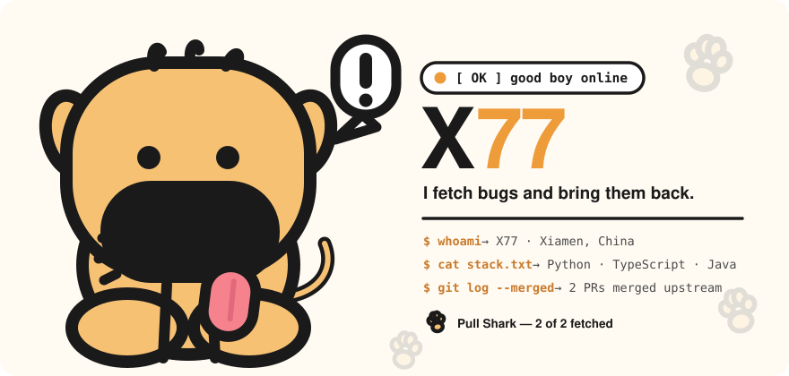
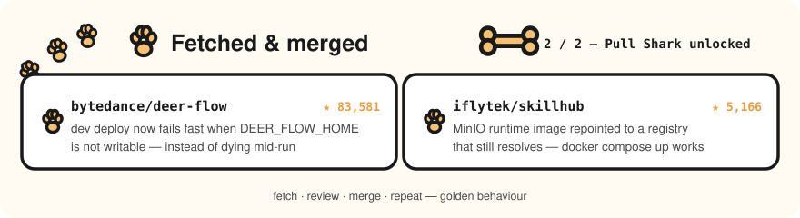

  

 

  <b>X77</b> &nbsp;·&nbsp; Xiamen, China &nbsp;·&nbsp; Python / TypeScript / Java

  I read the source before I file the report. Most of what I ship upstream is the unglamorous part —
  deploy paths that fail loudly, registry mirrors that still resolve, docs that point at pages that exist.
  I sniff out the boring ones, fetch them, and bring them back.

 

  

 

## Now

- Contributing upstream to AI-agent infrastructure — deployment scripts, container registry mirroring, documentation.
- Building **contrib-radar**, an Agent Skill that scopes open-source targets, scores how approachable an issue really is, and refuses to hand you one that somebody already claimed.

## Upstream

| Project | What I did |
| :--- | :--- |
| [`bytedance/deer-flow`](https://github.com/bytedance/deer-flow) | Made the dev deploy path fail fast when `DEER_FLOW_HOME` is not writable, instead of dying halfway through with a root-ownership error. |
| [`iflytek/skillhub`](https://github.com/iflytek/skillhub) | Repointed the MinIO runtime image to a registry that still serves it, so `docker compose up` works again. |

## Toolbox

  <code>Python</code> <code>TypeScript</code> <code>Java</code> <code>Docker</code>
  <code>GitHub Actions</code> <code>Bash</code> <code>Postgres</code> <code>Redis</code>

## Contact

- Email — [1494159925@qq.com](mailto:1494159925@qq.com)

---

  <i>stay curious, fetch often. 🐾</i>

